<div align="center">

# ⚘ Persephone

**A local-first AI companion with deep research, persistent memory, and an editorial sense of design.**

*Queen of the underworld, herald of spring — your private, offline‑capable AI workspace that runs entirely on your own machine via [Ollama](https://ollama.com).*

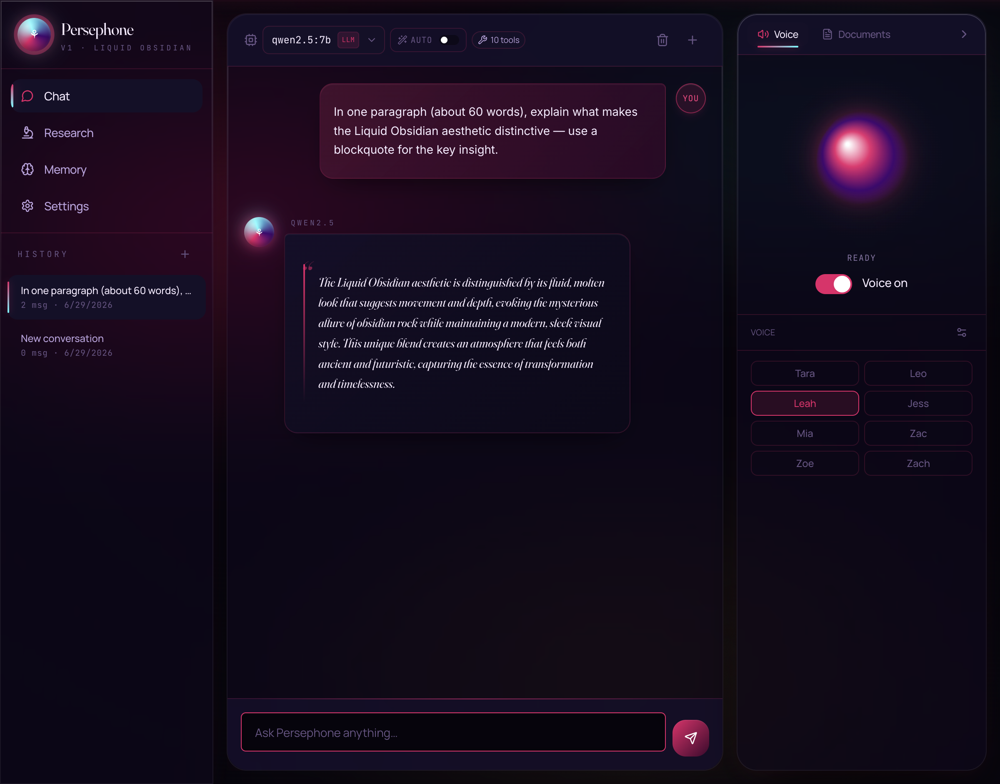

---

</div>

## Why Persephone

Persephone wraps the speed of local Ollama models in a thoughtful, beautifully designed app that goes far beyond a chat box:

- 🧠 **Persistent memory across every model.** Tell her your name once — every model from `qwen2.5:0.5b` to `gemma4:26b` will know it from then on.
- 🔮 **Smart auto-router.** A two-stage hybrid classifier picks the right model for each turn — `qwen2.5:0.5b` for *"hi"*, `qwen2.5-coder:7b` for *"refactor this function"*, `qwen3:ohm` for deep reasoning, all in milliseconds.
- 🛠 **MCP tools out of the box.** DuckDuckGo, Brave Search, Fetch, Filesystem (**incl. a Persephone-scoped filesystem for the repo itself**), Git, SQLite, Memory, Puppeteer, Sequential Thinking — toggle on with one click; servers spawn automatically.
- 🐦 **Ornith Coder mode.** One-click sidebar preset that switches the active model to `ornith:latest` (Qwen3-based 9B agentic coder, 262K context) and injects a plan → approve → diff → README → commit workflow. Wired to the `persephone-fs` MCP for real repo access.
- 🔬 **Deep research engine.** Decomposes a question into sub-questions, searches the web, fetches sources, embeds chunks, and synthesises a fully-cited markdown report with a generative SVG cover.
- 📚 **Persistent knowledge base.** Every research run feeds chunks into a `sqlite-vec` semantic index — search across everything you've ever researched.
- 🎙 **In-process TTS.** Orpheus / SNAC neural codec for natural-sounding voice playback, with 8 voices.
- 📄 **Intelligent document processing.** OCR, handwriting, tables, summarise, Q&A, redact, translate — local-only.
- 🎨 **Liquid Obsidian design system.** Five thoughtfully crafted themes (Underworld, Spring, Pomegranate, Elysian, Obsidian) with conic gradients, atmospheric grain, holographic accents, and ornamental SVG dividers.
- 🖼 **Editorial rich-markdown rendering.** Drop caps, pull-quotes, numbered orbs, hand-drawn rough.js borders on code blocks, auto-rendered Mermaid diagrams, generative SVG covers — every response feels designed.
- 📦 **Native macOS & Windows apps.** Ships as a code-signable Electron + bundled Python `.dmg`/`.exe` — zero-config first launch.

---

## Screenshot tour

### The setup wizard

A 15-step guided onboarding that:
1. Detects your hardware (RAM, CPU, GPU, performance tier)
2. Installs / starts Ollama if missing
3. Recommends the right models for *your* machine
4. Lets you pick: main chat model, **auto-router judge**, vision, code, OCR, document AI, handwriting, tables, voice, MCP tools, and theme
5. Pulls every selected model with a live progress bar
6. Ends with a summary you can review before launching

|   |   |
|---|---|
| 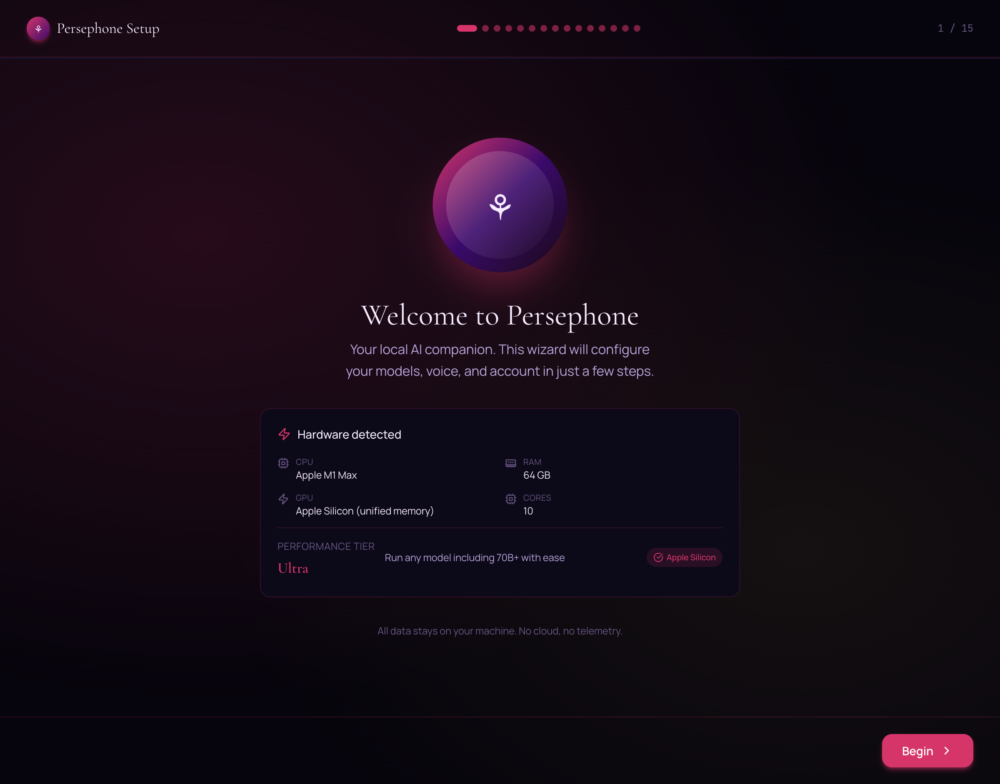 | 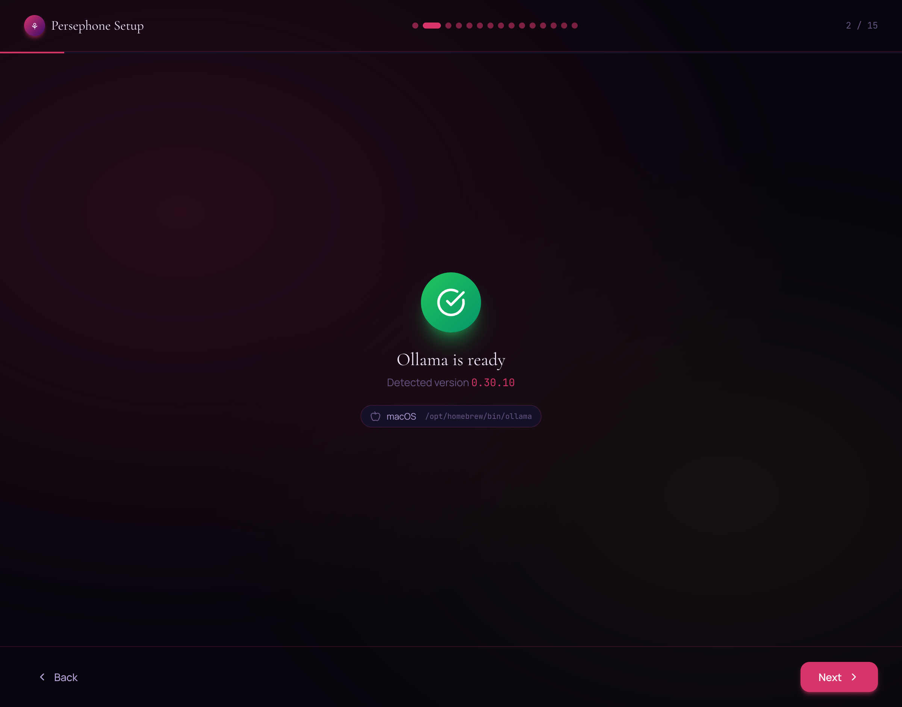 |
| **1. Welcome** — Hardware autodetection with performance tier (Ultra / High / Mid / Low / Minimal). | **2. Ollama** — Verifies installation, helps you install if missing, starts the service. |
| 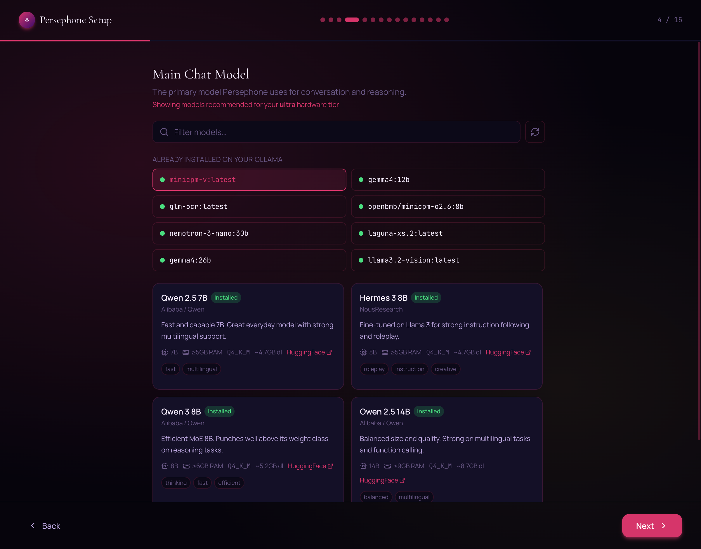 | 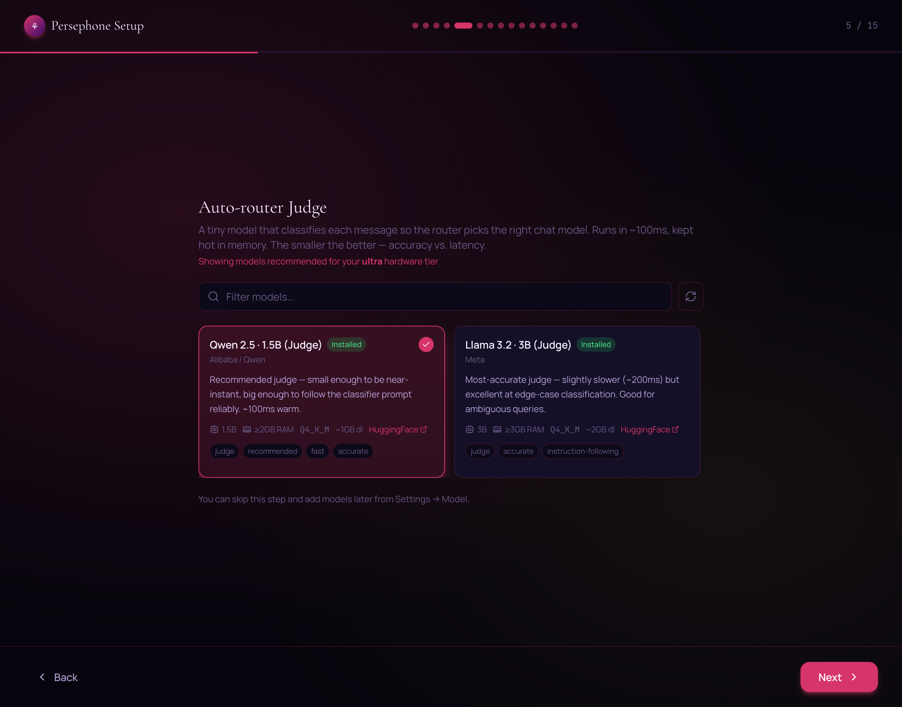 |
| **3. Main chat model** — Tier-filtered catalog. Cards show size, RAM, capabilities, one-click pull. | **4. Auto-router judge** — Pick a tiny classifier (qwen2.5:0.5b / 1.5b / llama3.2:3b) that decides which model handles each turn. |
| 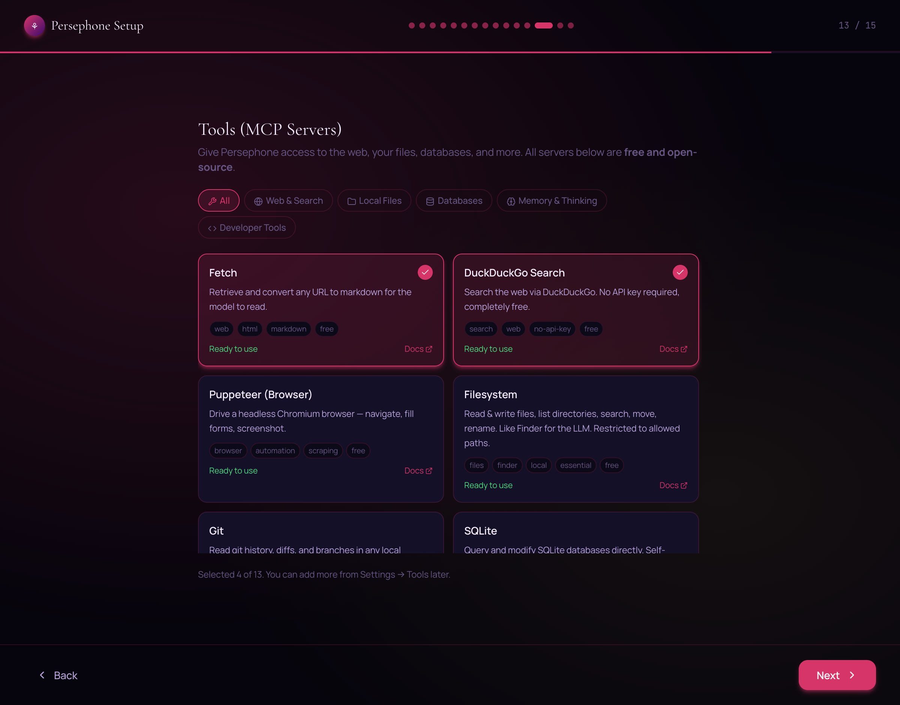 | 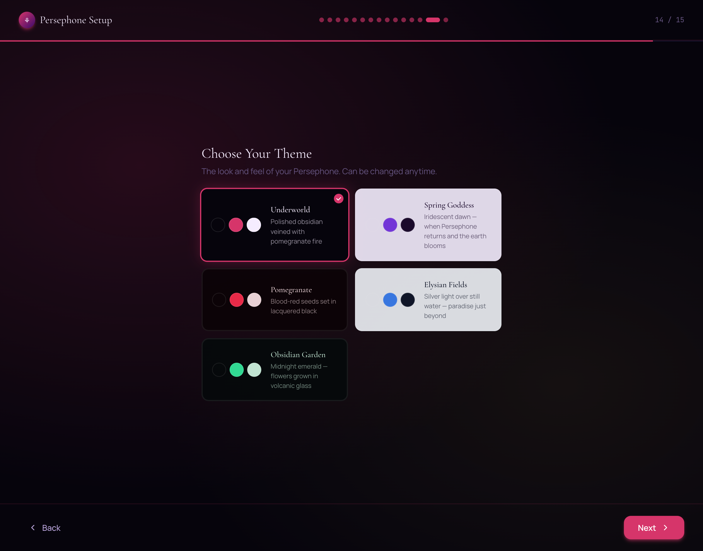 |
| **12. MCP tools** — Curated catalog of free MCP servers. Click to enable; servers spawn automatically. | **13. Theme** — Choose from five Liquid Obsidian palettes. |
| 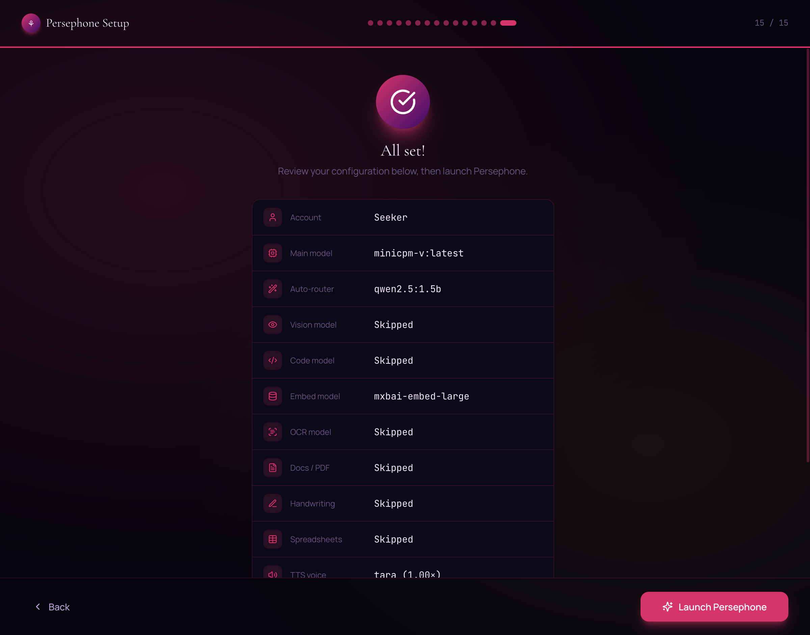 |  |
| **14. Launch** — Review every choice before opening the app. |  |

### The main chat

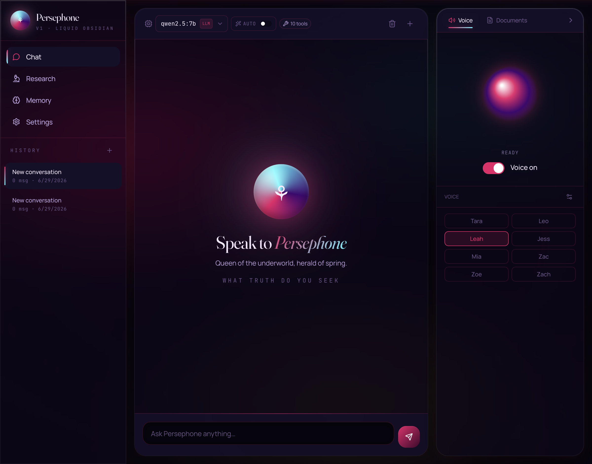

> *Speak to Persephone — Queen of the underworld, herald of spring.*

The empty hero state shows the conic-gradient orb, the gradient italic Fraunces wordmark, and the tracked-letter monospace tagline. Every detail is themed.


A real reply: the **auto-route chip** ("auto · …") next to the model badge tells you which model the router picked. The blockquote renders as an editorial pull-quote with the oversized opening `"` glyph; the AI avatar is a small holographic orb; the right panel hosts the voice + documents tools.

### Deep research

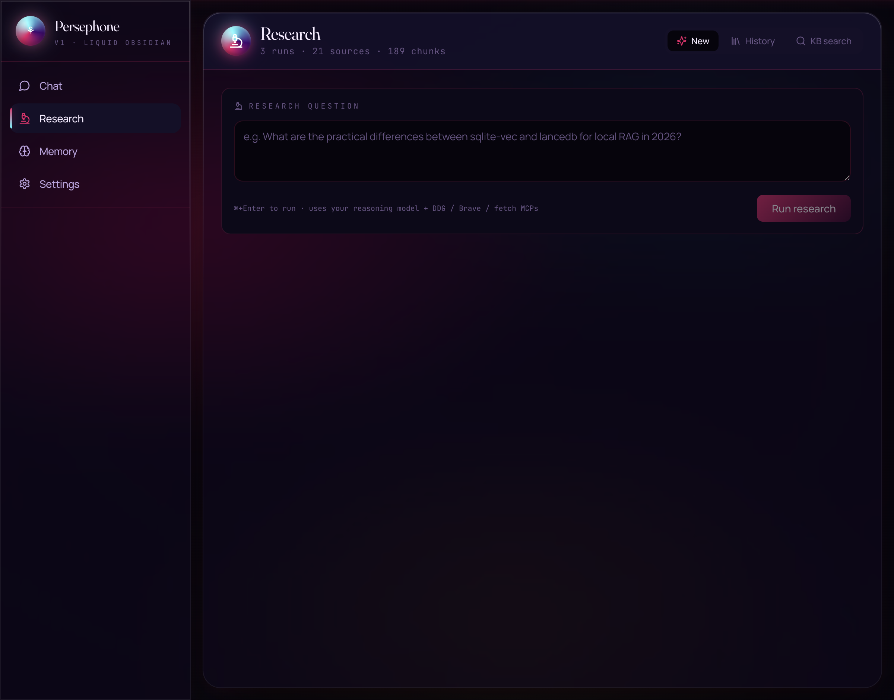

The Research tab. Live header stats show **runs · sources · chunks** in your knowledge base. Three tabs: **New** (run a query), **History** (past reports), **KB search** (semantic search across every chunk you've ever researched). The example placeholder hints at the right kind of question.


A completed report: **generative SVG cover art** at the top (deterministic from the query hash — same query, same cover); **H1 with holographic vertical accent**, **H2s with glowing radial-gradient orbs**, **ornamental dividers** between sections, **diamond bullets**, **Fraunces drop-cap on the lede**, and **proper `[N]` footnote citations** linking to all sources. When the model emits a ```` ```mermaid ```` block, it renders as a real diagram in the theme palette.

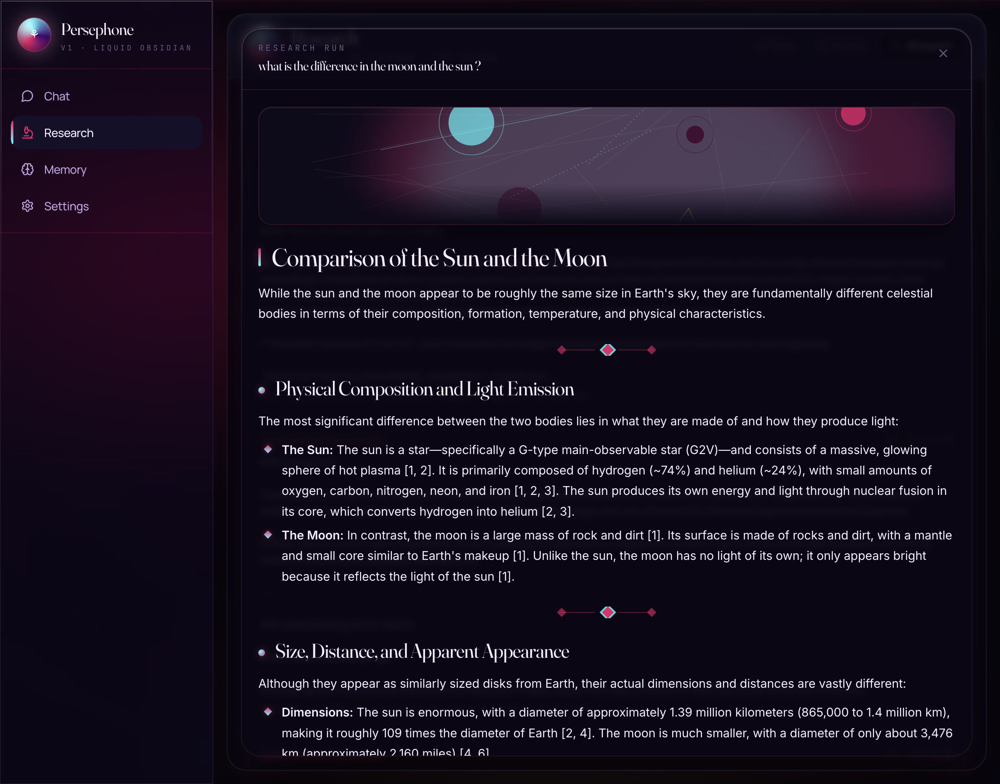

Semantic search across every research chunk you've stored. Results are ranked by cosine distance via `sqlite-vec`, with the source URL, the chunk text, and the originating research query.

### Memory

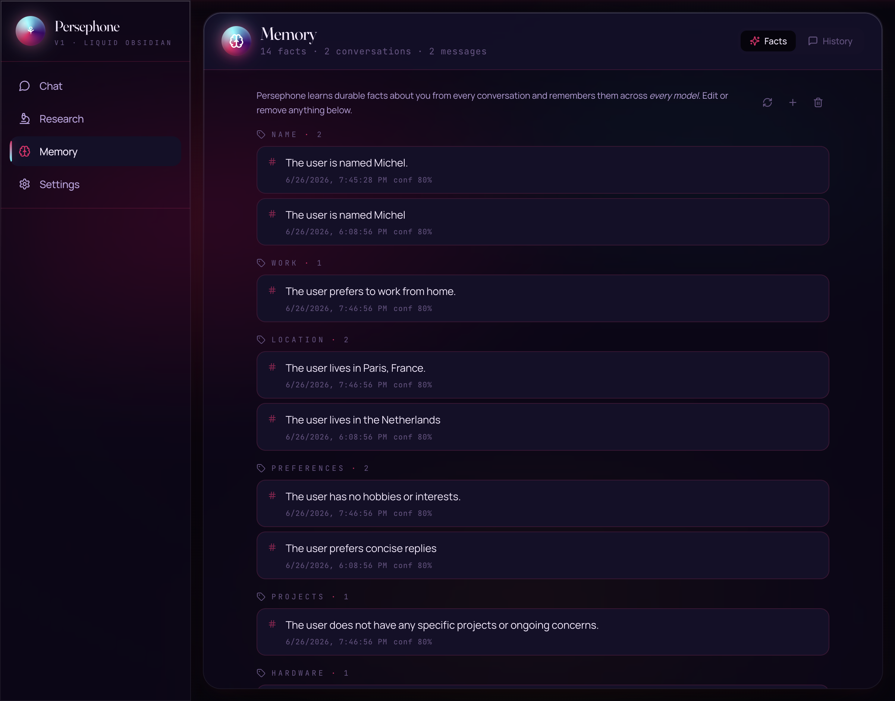

The Memory page has two tabs:
- **Facts** — Persephone's auto-extracted understanding of you, grouped by category (name, location, work, hardware, preferences, family, projects). Every fact lists when it was learned. Add manual facts, delete individual ones, or clear all.
- **History** — every conversation, with its model, message count, last reply preview.

### Settings → Tools (MCP)

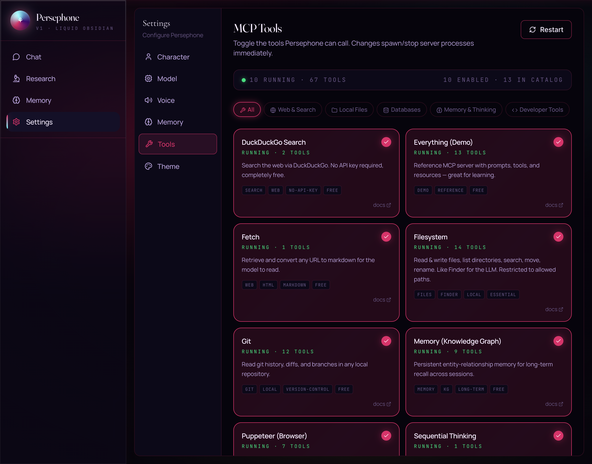

Live MCP server management. The header strip shows running servers + total tools. Click any card to toggle — the backend spawns or kills the server process immediately. Cards show capability tags, install status ("RUNNING · 14 TOOLS"), and link to docs. Sorting is **enabled first → no-setup → needs API key**.

---

## Architecture

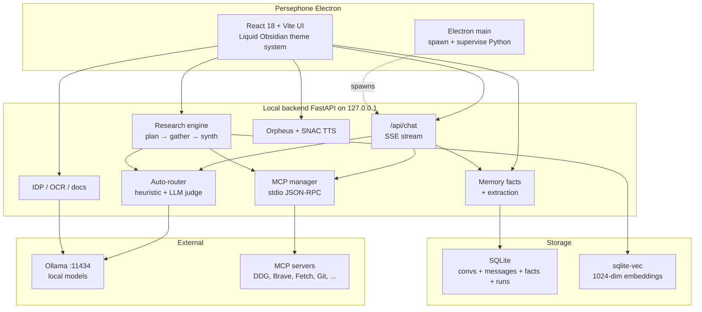

**No data ever leaves your machine.** Every request to Ollama is `127.0.0.1`. Every MCP server runs as a local subprocess. Every embedding stays in your SQLite file.

---

## Installation

### Option 1 — Build a native app (recommended for users)

**macOS (`.dmg`)**

```bash
git clone https://github.com/<you>/persephone
cd persephone
npm install
npm run dmg
# Output: dist-electron/Persephone-1.0.0-arm64.dmg
```

**Windows (`.exe` installer)** — run on a Windows machine:

```powershell
git clone https://github.com/<you>/persephone
cd persephone
npm install
npm run exe
# Output: dist-electron\Persephone Setup 1.0.0.exe
```

Both bundle:
- A portable **Python 3.11** (via [`python-build-standalone`](https://github.com/astral-sh/python-build-standalone)) with all dependencies pre-installed
- The **FastAPI backend**, **SQLite database** template, and **MCP catalog**
- The compiled **React frontend**

First launch is zero-config — you'll still need Ollama installed separately (the in-app wizard guides you).

> The current build is **unsigned**. On macOS, right-click the app → Open → Open to bypass Gatekeeper; to distribute publicly, set your Apple Developer ID in `package.json` `build.mac` and flip `hardenedRuntime: true`. On Windows, SmartScreen will warn on first run ("More info" → "Run anyway") until the installer is code-signed.

### Option 2 — Run from source (developers)

Prerequisites:
- Node 20+
- Python 3.11+ (on Windows, make sure `python` is on `PATH` — the installer's "Add python.exe to PATH" checkbox)
- [Ollama](https://ollama.com/download) running locally

```bash
git clone https://github.com/<you>/persephone
cd persephone

# Install deps
npm install
pip install -r server/requirements.txt

# Dev (Vite + FastAPI hot-reload + Electron)
npm run electron:dev

# Or web-only (no Electron wrapper)
npm run dev   # opens http://localhost:5173
```

Works the same way on Windows (PowerShell or cmd) — `npm run dev` and `npm run electron:dev` auto-detect the platform and shell out to `python`/`python3` accordingly.

#### Troubleshooting

**`ERROR fastapi Form data requires "python-multipart" to be installed.`**
Document upload (`/api/idp/upload`) uses FastAPI's multipart form parsing, which needs the `python-multipart` package. It's in `server/requirements.txt`, so a fresh `pip install -r server/requirements.txt` covers it — if you see this error on an existing checkout, just re-run that install command (or `pip install python-multipart` directly).

**Windows: Electron window never opens / `Electron failed to install correctly`**
On some Windows machines (commonly when an antivirus/EDR product is intercepting file writes), Electron's own postinstall silently fails to fully extract its binary from the downloaded zip — `npm install` reports success, but `node_modules/electron/dist/electron.exe` never gets written, and `npm run electron:dev` then crashes immediately. This is now handled automatically: a `postinstall` script (`scripts/ensure-electron.mjs`) verifies the binary actually exists and, on Windows, re-extracts it with PowerShell's `Expand-Archive` if not — it also runs defensively before every `npm run electron:dev`. If it still can't repair itself, it prints what's wrong; the usual fix is excluding the project folder and `%LOCALAPPDATA%\electron\Cache` from real-time antivirus scanning, then deleting `node_modules/electron` and running `npm install` again.

---

## What Persephone can do

### 1 · Chat with any local Ollama model

The model selector is a rich popover, not just a `<select>`:

- Search by name, vendor, capability, or strengths
- Each model card shows: type chip (LLM / MoE / Vision), param size, context window, capability icons (🔧 tools, 👁 vision, 🧠 thinking)
- Click to expand for the full spec sheet: tagline, strengths, "best for", license, quantization, and live data fetched from Ollama's `/api/show`

### 2 · The smart auto-router

Toggle **`AUTO`** in the chat header and Persephone picks the right model for every turn:

| User says | Routed to | Why |
|---|---|---|
| `"hi"` | qwen2.5:0.5b | trivial → fastest possible model |
| `"refactor this Python class"` | qwen2.5-coder:7b | code task → coder model |
| `"what's the weather in Tokyo?"` | qwen2.5:7b + DuckDuckGo MCP | needs tools → tool-capable |
| `"do you know my name?"` | qwen2.5:7b | personal recall → memory-capable |
| `"prove sqrt(2) is irrational"` | qwen3:ohm | reasoning → reasoning model |
| `"can you help me figure something out?"` | judge decides | ambiguous → LLM classifier |

**How it works:**
- **Fast path** — a regex / keyword heuristic. ~0.001ms. Catches 90% of cases.
- **Slow path** — when heuristic confidence is low, a tiny classifier (e.g. qwen2.5:1.5b) decides in ~150ms via Ollama's structured-output JSON.
- **Cache** — per-conversation, with category-aware TTL (30s for low-trust picks, 5min for code/reasoning).
- **Pre-warmed** — the judge is hot-loaded at app startup so the first ambiguous query pays no cold-load tax.

Pick your judge model in the wizard step **4 · Auto-router**.

### 3 · Persistent memory across every model

Tell Persephone *"my name is Michel, I run an M1 Pro, I prefer concise replies"* — after the assistant replies, a tiny background extractor (one of qwen2.5:0.5b, 1.5b, llama3.2:1b, …) reads the turn and stores durable facts in SQLite:

```
[name]        The user is named Michel.
[location]    The user lives in the Netherlands.
[hardware]    The user runs an M1 Pro Mac.
[preferences] The user prefers concise replies.
```

Every subsequent chat — on *any* model — receives those facts in the system prompt under "## What I know about you". Switch from qwen2.5:7b to gemma4:12b mid-conversation; the new model still knows your name.

The extractor is **throttled** (every 3rd turn per conversation, singleton lock) so it never competes with the next user message for the GPU. Hardening rejects extracted facts that look like JSON leakage, role markers, or assistant persona confusion (e.g. "the user is named Persephone").

Edit / delete / add facts manually in **Memory → Facts**.

### 4 · Deep research with citations and a knowledge base

Open **Research → New**, type a question, hit run. The engine:

1. **Plans** — your question becomes 3-5 standalone sub-questions (via structured JSON to a non-thinking model).
2. **Gathers** — for each sub-question: web search via DuckDuckGo (or Brave if enabled) → fetch top N URLs via the `fetch` MCP → chunk into ~500-token pieces → embed with `mxbai-embed-large` → store in `sqlite-vec`.
3. **Synthesizes** — a reasoning model writes a markdown report with `[N]` citations, headings, lists, optional Mermaid diagrams, and a `## Sources` section. Empty-content retry on qwen2.5:7b as a safety net.
4. **Persists** — every chunk becomes a row in `research_chunks` with a 1024-dim embedding in `research_chunks_vec`. Stays available forever.

**KB search** queries the embedding index across every report you've ever run. Ranked by cosine distance, results show the chunk text, source URL, and the originating research query.

### 5 · MCP tool calling

Persephone ships with a curated catalog of free MCP servers:

| Category | Servers |
|---|---|
| **Web & Search** | Fetch, DuckDuckGo, Brave Search, Puppeteer |
| **Files & Local** | **Persephone Filesystem (pre-scoped to the repo, for Ornith Coder mode)**, Filesystem (Documents/Downloads/Desktop), Git, SQLite |
| **Knowledge** | Memory (knowledge graph), Sequential Thinking, Time |
| **Developer** | GitHub, GitLab |
| **Demo** | Everything (reference server) |

Enable in **Settings → Tools** with one click — the backend spawns the subprocess immediately, exposes the tools to Ollama via the standard `tools` array, and routes tool calls back through MCP's JSON-RPC stdio protocol.

A **tool-gating heuristic** only attaches tools to chats whose latest user message mentions tool-suggesting keywords (weather, search, file, find, today, fetch, URL, git, etc.) — so casual conversation doesn't pay the 2-3KB prompt cost.

For chat models that *can't* natively call tools, set a **tool_model** override (default `qwen2.5:32b`): a tool-capable model invokes the tool, then your active chat model synthesises the final answer.

### 6 · Intelligent Document Processing (IDP)

The right panel hosts a document viewer with:
- Upload any PDF, image, scan
- **OCR** with your chosen vision/OCR model (MiniCPM-V, Qwen 2.5 VL, Granite Vision)
- **Summarize** (brief / detailed)
- **Q&A** — ask questions about a document's contents
- **Tables** — extract tables as JSON
- **Entities** — pull named entities
- **Classify** — categorize the document
- **Translate** to a target language
- **Redact** specified categories
- **Export** as Markdown / TXT / PDF / JSON / XLSX / CSV

All processing is local. Each operation routes to the model you configured during the wizard for that category.

### 7 · Voice (TTS)

Built-in **Orpheus** TTS with the SNAC 24kHz neural codec, loaded once at startup. Eight voices (Tara, Leo, Leah, Jess, Mia, Zac, Zoe, Zach), speed control, auto-play, sentence-streaming so audio starts as soon as the first sentence is generated.

### 8 · Editorial rich-markdown rendering

Every model reply is rendered with custom React-Markdown components:

- **H1** — holographic vertical accent bar
- **H2** — glowing radial-gradient orb prefix + ornamental SVG divider above
- **H3** — accent `⊹` glyph prefix
- **First paragraph of a report** — Fraunces variable-serif drop cap with gradient text fill
- **Blockquote** — editorial pull-quote with oversized opening `"` glyph
- **Ordered lists** — circular gradient-badge numbered orbs via CSS counters
- **Unordered lists** — rotated diamond bullets with accent → holo gradient + glow
- **`<hr>`** — ornamental three-diamond divider
- **Code blocks** — hand-drawn rough.js sketch borders with language captions
- **Tables** — hand-drawn holo-coloured rough.js frames
- ```` ```mermaid ```` **blocks** — auto-rendered as real diagrams in the theme palette, with a defensive sanitiser that auto-fixes common LLM syntax mistakes (trailing `;`, unquoted multi-word labels, bare multi-word node IDs) on a silent retry

Plus **generative SVG cover art** at the top of research reports — deterministic from the query hash, so the same query always produces the same cover; theme-aware colours.

### 9 · Ornith Coder mode

A one-click preset that turns Persephone into a project-aware coding assistant for **this repo**.

Click the **Ornith Coder** button in the bottom-left of the sidebar. Persephone snapshots your current model + system prompt, then swaps in:

- **Model:** `ornith:latest` — a Qwen3-based 9B agentic coder with 262K context and native tools + thinking. Small enough to be snappy, big enough to reason across a whole repo.
- **System prompt:** a strict *plan → approve → diff → README → commit* workflow. Ornith must:
  1. Read (or create) `.ornith/memory.md` — its private notebook for durable findings about the project.
  2. Explore the relevant files via the `persephone-fs` MCP before answering — no guessing, no fake `bash ls` blocks.
  3. Show a numbered plan and stop with **"Approve this plan? (yes / adjust)"**.
  4. On approval, show every change as paired `(OLD)` / `(NEW)` fenced blocks per file, apply them via `persephone-fs`, then update `README.md`.
  5. Stop again with **"Ready to commit and push? (yes / no)"**.
  6. On approval, use the `git` MCP to stage, commit with a multi-line message explaining what/why, and push.

Backend wiring: Ornith is recognised as a native-thinking Qwen3 model, gets a 16 384-token `num_predict` floor and a 32 K `num_ctx` on every round (a `list_directory src/` + the workflow prompt already blows the 8 K default), and has its MCP tool array **force-attached** — the usual keyword heuristic would gate tools off on requests like *"summarise Persephone"*, which is precisely when an agentic coder needs them most.

Click the button again to restore your previous model and system prompt. State persists across restarts.

Prerequisites: the `persephone-fs` and `git` MCP servers must be enabled in **Settings → Tools**.

### 10 · Five themes

- **Underworld** — Polished obsidian veined with pomegranate fire (default)
- **Spring Goddess** — Iridescent dawn, light theme
- **Pomegranate** — Blood-red on lacquered black
- **Elysian Fields** — Silver light over still water (light theme)
- **Obsidian Garden** — Midnight emerald

Switch any time in Settings → Theme. Every accent, shadow, and gradient updates instantly via CSS variables.

---

## Technical details

### Performance optimisations

| Lever | What it does |
|---|---|
| `keep_alive: 10m` | Active chat model stays hot in VRAM between turns (no 1-5s reload). Old model evicts when you switch, so VRAM doesn't pile up. |
| Sliding history window | Only the last 16 messages are sent on each turn — long conversations stay snappy. Full transcript still in SQLite. |
| Memory + MCP context caching | 20s TTL on the two heavy system-prompt builders; invalidated on memory/MCP changes. |
| Tool gating | Heuristic skips the 2-3KB `tools` array when the user's latest message clearly doesn't need tools. |
| Memory skip on trivial turns | "hi" / "thanks" / acks don't get the persistent-facts block injected. |
| Aggressive tool description clamp | MCP tool descriptions clamped to first sentence (≤200 chars) — the schema is what the model actually uses. |
| Parallel context build | Memory + MCP contexts built concurrently via `asyncio.gather`. |
| Throttled fact extraction | Singleton semaphore + every-Nth-turn — never competes with active chat for GPU. |
| Pre-warmed judge | Auto-router judge fired once at startup so the first ambiguous query is warm. |

### Stack

- **Frontend** — React 18, Vite 6, Tailwind 3, Framer Motion 11, Zustand, React Markdown, Mermaid 11, Rough.js, Sharp (icon gen)
- **Backend** — FastAPI, Uvicorn, httpx, aiosqlite, sqlite-vec, PyTorch (for SNAC TTS), SNAC, NumPy, SciPy
- **Desktop** — Electron 33, electron-builder 25
- **Models** — Any Ollama-compatible: Qwen 2.5 / 3 / 3.6 (incl. AgentWorld), Gemma 3 / 4, Llama 3.1 / 3.2 / 3.3, Nemotron / Nemotron 3 Nano, Mistral, DeepSeek, Phi-4, Hermes 3, MiniCPM-V / MiniCPM-O, Granite, **Ornith** (Qwen3 coder, 262K ctx), **olmOCR 2**, GLM-OCR, etc. Catalog lives in `server/model_catalog.py`.
- **Embeddings** — `mxbai-embed-large` (1024-dim, MixedBread AI) via Ollama `/api/embed`
- **Vector store** — `sqlite-vec` virtual table (KNN via `WHERE embedding MATCH ? AND k = ?`)
- **TTS** — Orpheus 3B + SNAC 24kHz codec, in-process Python (no model swap)

### Project layout

```
persephone/
├── electron/             ← Electron main + preload (CJS)
├── scripts/              ← bundle-python.mjs, generate-icon.mjs, dev/electron-dev orchestrators
├── server/               ← FastAPI backend
│   ├── main.py           ← all HTTP endpoints + chat stream + auto-router
│   ├── research.py       ← deep research engine
│   ├── research_db.py    ← sqlite-vec KB storage
│   ├── embeddings.py     ← Ollama /api/embed wrapper
│   ├── db.py             ← aiosqlite layer for convs/messages/facts/config
│   ├── mcp_*.py          ← MCP catalog + client + manager (JSON-RPC over stdio)
│   ├── idp_engine.py     ← document processing
│   ├── tts_engine.py     ← Orpheus + SNAC
│   ├── hardware.py       ← M-series + tier detection
│   ├── model_catalog.py  ← curated tier-aware model recommendations
│   ├── ollama_setup.py   ← cross-platform install + lifecycle
│   └── requirements.txt
├── src/                  ← React frontend
│   ├── components/
│   │   ├── chat/         ← ChatWindow, MessageBubble, ChatInput, ModelSelector, ThinkingPanel, ToolCallList
│   │   ├── research/     ← ResearchView (run / history / KB search / detail overlay)
│   │   ├── memory/       ← MemoryView (facts + history)
│   │   ├── markdown/     ← RichMarkdown, Mermaid, SketchBorder, OrnamentalDivider, CoverArt
│   │   ├── wizard/       ← 15-step setup wizard
│   │   ├── settings/     ← character / model / voice / memory / tools / theme
│   │   ├── documents/    ← IDP panel
│   │   ├── voice/        ← VoicePanel (sphere, voice picker)
│   │   ├── layout/       ← AppLayout, Sidebar, RightPanel
│   │   └── ui/           ← Button, Input, Slider, Toggle, Panel, Badge, Select
│   ├── themes/           ← 5 themes as CSS-variable bundles
│   ├── lib/              ← ollama (stream chat), tts, idp, modelMeta
│   ├── store/            ← Zustand store (persisted to localStorage)
│   └── types/
├── build/                ← icon.png + icon.icns (generated)
└── package.json          ← electron-builder config + scripts
```

### Useful endpoints

```
POST   /api/chat                     SSE stream of one chat turn
GET    /api/models                   list installed Ollama models
GET    /api/models/details/{model}   /api/show proxy
POST   /api/models/pull              SSE stream of an ollama pull
DELETE /api/models/{model}           ollama rm

GET    /api/memory/conversations     list saved conversations
POST   /api/memory/facts             add a manual fact
GET    /api/memory/facts             list all stored facts
DELETE /api/memory/facts/{id}        delete one
POST   /api/memory/facts/purge_invalid  one-shot cleanup pass

POST   /api/research/start           SSE stream of a research run
GET    /api/research/runs            list past runs
GET    /api/research/runs/{id}       full report + sources
GET    /api/research/search?q=...    semantic search across KB
GET    /api/research/stats           runs/sources/chunks counts

GET    /api/mcp/catalog              curated MCP server list
GET    /api/mcp/enabled              currently enabled IDs
POST   /api/mcp/enabled              set enabled list (spawns/stops processes)
GET    /api/mcp/status               runtime status of each client
GET    /api/mcp/tools                flat list of all running tools

POST   /api/idp/upload               upload a file
POST   /api/idp/ocr                  extract text
POST   /api/idp/summarize            summarise
POST   /api/idp/qa                   ask a question
POST   /api/idp/tables               extract tables
POST   /api/idp/translate            translate
POST   /api/idp/redact               redact PII / categories
POST   /api/idp/export/{fmt}         export as md/txt/pdf/json/xlsx/csv

POST   /api/tts                      synthesize speech (WAV)
GET    /api/tts/voices               list Orpheus voices

GET    /api/setup/hardware           CPU/GPU/RAM/tier
GET    /api/setup/recommendations    tier-filtered model catalog
POST   /api/setup/complete           persist wizard choices
POST   /api/setup/reset              re-run the wizard
```

---

## Configuration

### Default keep-alives

Edit `OLLAMA_DEFAULTS` and the `keep_alive` values in `server/main.py`:

- Chat model: `10m` (configurable)
- Background fact extraction: `30s`
- Auto-route judge: `5m`

### History sliding window

`_HISTORY_TURN_CAP = 16` in `server/main.py` — last 16 messages sent to the model. Full transcript persists in SQLite.

### Auto-router rules

`_ROUTER_RULES` in `server/main.py` — each rule has a `match` lambda, a `ranks` priority list of model tags, a `reason` string, and a `confidence` (`high` / `low`). Add your own rule for a new domain.

### Theme tokens

Each theme in `src/themes/index.ts` defines ~25 CSS variables (background ramp, accent ramp, holographic edge, gold, text scale, gradient bubble backgrounds, multi-stop shadow stack). Add a sixth theme by copying any existing entry.

---

## Contributing

This is a personal project I work on in the open. PRs welcome for:

- New themes
- Additional MCP servers in the catalog
- New router rules for under-served domains
- Better-tuned model recommendations per hardware tier
- Localisation
- A Linux build path

---

## License

MIT — do what you want, but no warranty.

---

<div align="center">

**Persephone** — *what truth do you seek?*

</div>
