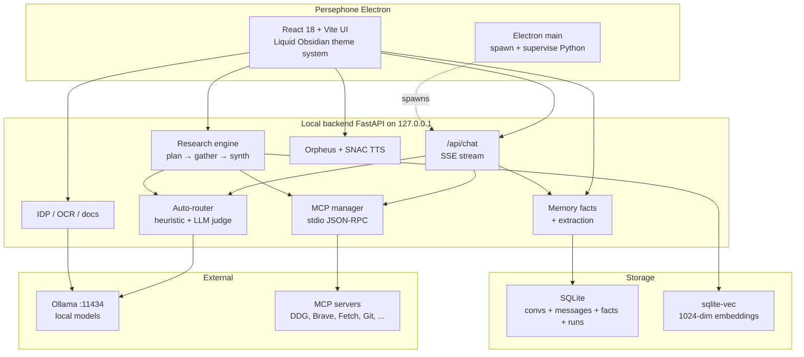

<div align="center">


# Persephone

**A local-first AI companion with deep research, persistent memory, browser-style tabs, background workers, and an editorial sense of design.**

*Queen of the underworld, herald of spring — your private, offline‑capable AI workspace that runs entirely on your own machine via [Ollama](https://ollama.com).*


---

</div>

## Why Persephone

Persephone wraps the speed of local Ollama models in a thoughtful, beautifully designed app that goes far beyond a chat box:

- 🧠 **Persistent memory across every model.** Tell her your name once — every model from `qwen2.5:0.5b` to `gemma4:26b` will know it from then on.
- 🗂 **Browser-style tabs in the main chat.** `⌘T` opens a new tab, `⌘W` closes, `⌘1..9` switches. Each tab runs its own conversation and its own model — and each tab streams **truly in parallel** (Persephone auto-configures Ollama's `OLLAMA_NUM_PARALLEL` / `MAX_LOADED_MODELS` from Settings → Setup).
- 🤖 **Auxiliary worker models.** Type a question, hit the amber Bot button (or ⌘/Ctrl+Enter) → the judge model picks the best category (research / code / vision / deep / …), dispatches a specialist worker in the background, and streams its thinking + tool calls + reply live in the right-panel "Auxiliary" tab. Main chat stays completely free while workers run.
- 🔬 **Deep research engine.** Decomposes a question into sub-questions, searches the web, fetches sources, embeds chunks, and synthesises a fully-cited markdown report — with a one-click **PDF export**.
- 📚 **Persistent knowledge base.** Every research run feeds chunks into a `sqlite-vec` semantic index — search across everything you've ever researched.
- 🔮 **Smart auto-router.** A two-stage hybrid classifier picks the right model for each turn — `qwen2.5:0.5b` for *"hi"*, `qwen2.5-coder:7b` for *"refactor this function"*, `qwen3:ohm` for deep reasoning, all in milliseconds.
- ⏱ **Hardware-aware model recommendations.** Setup wizard fingerprints your chip (M1/M2/M3/M4/Intel/AMD Zen) + estimates memory bandwidth, then shows a per-model tok/s estimate coloured by fit — hides models that won't clear a 20 tok/s target on your hardware.
- 🛠 **MCP tools out of the box.** DuckDuckGo, Brave Search, Fetch, Filesystem (**incl. a Persephone-scoped filesystem for the repo itself**), Git, SQLite, Memory, Puppeteer, Sequential Thinking — toggle on with one click; servers spawn automatically.
- 🎬 **Reels studio.** Sidebar tab. Type a topic, pick tone + duration + aspect, and Persephone plans scenes (script + image prompt + timing per scene) via the active LLM, drives ComfyUI for stills OR your own uploaded footage, layers Kokoro voice-over OR keeps the source speaker talking, burns in captions (from the script or from a live Whisper transcript with translate-to-English), applies per-scene look effects (brightness / contrast / saturation / speed / grayscale), then ffmpeg composites a 9:16 TikTok/Reels/Shorts MP4 with sidechain-ducked background music.
- 🎹 **Ableton Live AI composer.** Detects a running Ableton Live 12 install, one-click installs the AbletonOSC bridge + Persephone's browser patch, and exposes a **Music** tab. Track-first workflow: add / remove / edit tracks individually, ▶ preview each in solo, ⚡ apply single tracks or the whole song. **Song library** for save / browse / load. Standard composer runs on **`qwen3.6:35b-a3b`**; toggle "Deep reasoning" to swap to **`gemma4:26b`**. Both models configurable in Settings.
- 🛰 **Background workers.** A dedicated **Workers** sidebar tab shows in-flight and idle helpers. Ships with **Memory Curator** (dedupes facts + re-extracts from rushed conversations every 15 min when idle) and **Model Warmer** (keeps the active chat model resident so big models like Llama 3.3 70B skip the 30-90s cold-load). Add your own tasks via the workers API.
- 📝 **PDF export.** Extensive chat replies (long-form answers with headings, code, tables) auto-surface a PDF export button in their action strip. Same for research reports — one click → styled A4 PDF with editorial typography.
- 🎙 **In-process TTS.** Kokoro-82M ONNX with 19 voices (US / UK / ES accents), auto-verified and pre-downloaded during the setup wizard so first speech is instant.
- 📄 **Intelligent document processing.** OCR, handwriting, tables, summarise, Q&A, redact, translate — local-only.
- 🎨 **Liquid Obsidian design system.** Five thoughtfully crafted themes (Underworld, Spring, Pomegranate, Elysian, Obsidian) with conic gradients, atmospheric grain, holographic accents, ornamental SVG dividers, and a shared **Persephone medallion** identity across the whole app.
- 🌫 **Ambient backdrop.** A pre-blurred watercolour painting sits behind every panel — never sharp, always atmospheric, glass panels stay fully legible on top.
- 🖼 **Editorial rich-markdown rendering.** Drop caps, pull-quotes, numbered orbs, hand-drawn rough.js borders on code blocks (with copy-to-clipboard), auto-rendered Mermaid diagrams, auto-generated section TOC on long answers, generative SVG covers — every response feels designed.
- 📦 **Native macOS & Windows apps.** Ships as a code-signable Electron + bundled Python `.dmg`/`.exe` — zero-config first launch. Draggable window from the sidebar header or a global top strip.

---

## Screenshot tour

### The setup wizard

A 15-step guided onboarding that:
1. Detects your hardware (RAM, CPU, GPU, performance tier)
2. Installs / starts Ollama if missing
3. Recommends the right models for *your* machine
4. Lets you pick: main chat model, **auto-router judge**, vision, code, OCR, document AI, handwriting, tables, voice, MCP tools, and theme
5. Pulls every selected model with a live progress bar
6. Ends with a summary you can review before launching

|   |   |
|---|---|
|  |  |
| **1. Welcome** — Hardware autodetection with performance tier (Ultra / High / Mid / Low / Minimal). | **2. Ollama** — Verifies installation, helps you install if missing, starts the service. |
|  |  |
| **3. Main chat model** — Tier-filtered catalog. Cards show size, RAM, capabilities, one-click pull. | **4. Auto-router judge** — Pick a tiny classifier (qwen2.5:0.5b / 1.5b / llama3.2:3b) that decides which model handles each turn. |
|  |  |
| **12. MCP tools** — Curated catalog of free MCP servers. Click to enable; servers spawn automatically. | **13. Theme** — Choose from five Liquid Obsidian palettes. |
|  |  |
| **14. Launch** — Review every choice before opening the app. |  |

### The main chat


> *Speak to Persephone — Queen of the underworld, herald of spring.*

The empty hero state shows the conic-gradient orb, the gradient italic Fraunces wordmark, and the tracked-letter monospace tagline. Every detail is themed.


A real reply: the **auto-route chip** ("auto · …") next to the model badge tells you which model the router picked. The blockquote renders as an editorial pull-quote with the oversized opening `"` glyph; the AI avatar is a small holographic orb; the right panel hosts the voice + documents tools.

### Deep research


The Research tab. Live header stats show **runs · sources · chunks** in your knowledge base. Three tabs: **New** (run a query), **History** (past reports), **KB search** (semantic search across every chunk you've ever researched). The example placeholder hints at the right kind of question.


A completed report: **generative SVG cover art** at the top (deterministic from the query hash — same query, same cover); **H1 with holographic vertical accent**, **H2s with glowing radial-gradient orbs**, **ornamental dividers** between sections, **diamond bullets**, **Fraunces drop-cap on the lede**, and **proper `[N]` footnote citations** linking to all sources. When the model emits a ```` ```mermaid ```` block, it renders as a real diagram in the theme palette.


Semantic search across every research chunk you've stored. Results are ranked by cosine distance via `sqlite-vec`, with the source URL, the chunk text, and the originating research query.

### Memory


The Memory page has two tabs:
- **Facts** — Persephone's auto-extracted understanding of you, grouped by category (name, location, work, hardware, preferences, family, projects). Every fact lists when it was learned. Add manual facts, delete individual ones, or clear all.
- **History** — every conversation, with its model, message count, last reply preview.

### Settings → Tools (MCP)


Live MCP server management. The header strip shows running servers + total tools. Click any card to toggle — the backend spawns or kills the server process immediately. Cards show capability tags, install status ("RUNNING · 14 TOOLS"), and link to docs. Sorting is **enabled first → no-setup → needs API key**.

---

## Architecture



**No data ever leaves your machine.** Every request to Ollama is `127.0.0.1`. Every MCP server runs as a local subprocess. Every embedding stays in your SQLite file.

---

## Installation

### Option 1 — Build a native app (recommended for users)

**macOS (`.dmg`)**

```bash
git clone https://github.com/<you>/persephone
cd persephone
npm install
npm run dmg
# Output: dist-electron/Persephone-1.0.0-arm64.dmg
```

**Windows (`.exe` installer)** — run on a Windows machine:

```powershell
git clone https://github.com/<you>/persephone
cd persephone
npm install
npm run exe
# Output: dist-electron\Persephone Setup 1.0.0.exe
```

Both bundle:
- A portable **Python 3.11** (via [`python-build-standalone`](https://github.com/astral-sh/python-build-standalone)) with all dependencies pre-installed
- The **FastAPI backend**, **SQLite database** template, and **MCP catalog**
- The compiled **React frontend**

First launch is zero-config — you'll still need Ollama installed separately (the in-app wizard guides you).

> The current build is **unsigned**. On macOS, right-click the app → Open → Open to bypass Gatekeeper; to distribute publicly, set your Apple Developer ID in `package.json` `build.mac` and flip `hardenedRuntime: true`. On Windows, SmartScreen will warn on first run ("More info" → "Run anyway") until the installer is code-signed.

### Option 2 — Run from source (developers)

Prerequisites:
- Node 20+
- Python 3.11+ (on Windows, make sure `python` is on `PATH` — the installer's "Add python.exe to PATH" checkbox)
- [Ollama](https://ollama.com/download) running locally

```bash
git clone https://github.com/<you>/persephone
cd persephone

# Install deps
npm install
pip install -r server/requirements.txt

# Dev (Vite + FastAPI hot-reload + Electron)
npm run electron:dev

# Or web-only (no Electron wrapper)
npm run dev   # opens http://localhost:5173
```

Works the same way on Windows (PowerShell or cmd) — `npm run dev` and `npm run electron:dev` auto-detect the platform and shell out to `python`/`python3` accordingly.

#### Managing the services

A single control CLI (`scripts/persephone.mjs`) handles the whole lifecycle with coloured, tagged output. Every command is aliased as an npm script.

```bash
npm start               # FastAPI + Vite (dev)
npm run start:electron  # FastAPI + Vite + Electron shell
npm stop                # kill FastAPI, Vite, Electron, and orphaned MCP subprocesses
npm restart             # stop → start
npm run restart:electron
npm run status          # port/pid snapshot + live /api/models probe
npm run help
```

`stop` is thorough: it kills anything bound to :8000 or :5173, sweeps for `server/main.py`, `server/mcp_persephone_git.py`, `node_modules/vite/bin/vite.js`, `mcp-server-*`, and Electron by process-name pattern, then upgrades to `SIGKILL` if anything is still on the ports 800ms later. This solves the common case where a failed `Ctrl+C` leaves a FastAPI process pinning port 8000 and its MCP children as zombies.

`npm run persephone -- dmg` and `npm run persephone -- exe` first stop everything, then delegate to the existing `npm run dmg` / `npm run exe` electron-builder flows.

#### Troubleshooting

**`ERROR fastapi Form data requires "python-multipart" to be installed.`**
Document upload (`/api/idp/upload`) uses FastAPI's multipart form parsing, which needs the `python-multipart` package. It's in `server/requirements.txt`, so a fresh `pip install -r server/requirements.txt` covers it — if you see this error on an existing checkout, just re-run that install command (or `pip install python-multipart` directly).

**Windows: Electron window never opens / `Electron failed to install correctly`**
On some Windows machines (commonly when an antivirus/EDR product is intercepting file writes), Electron's own postinstall silently fails to fully extract its binary from the downloaded zip — `npm install` reports success, but `node_modules/electron/dist/electron.exe` never gets written, and `npm run electron:dev` then crashes immediately. This is now handled automatically: a `postinstall` script (`scripts/ensure-electron.mjs`) verifies the binary actually exists and, on Windows, re-extracts it with PowerShell's `Expand-Archive` if not — it also runs defensively before every `npm run electron:dev`. If it still can't repair itself, it prints what's wrong; the usual fix is excluding the project folder and `%LOCALAPPDATA%\electron\Cache` from real-time antivirus scanning, then deleting `node_modules/electron` and running `npm install` again.

---

## What Persephone can do

### 1 · Chat with any local Ollama model

The model selector is a rich popover, not just a `<select>`:

- Search by name, vendor, capability, or strengths
- Each model card shows: type chip (LLM / MoE / Vision), param size, context window, capability icons (🔧 tools, 👁 vision, 🧠 thinking)
- Click to expand for the full spec sheet: tagline, strengths, "best for", license, quantization, and live data fetched from Ollama's `/api/show`

### 2 · The smart auto-router

Toggle **`AUTO`** in the chat header and Persephone picks the right model for every turn:

| User says | Routed to | Why |
|---|---|---|
| `"hi"` | qwen2.5:0.5b | trivial → fastest possible model |
| `"refactor this Python class"` | qwen2.5-coder:7b | code task → coder model |
| `"what's the weather in Tokyo?"` | qwen2.5:7b + DuckDuckGo MCP | needs tools → tool-capable |
| `"do you know my name?"` | qwen2.5:7b | personal recall → memory-capable |
| `"prove sqrt(2) is irrational"` | qwen3:ohm | reasoning → reasoning model |
| `"can you help me figure something out?"` | judge decides | ambiguous → LLM classifier |

**How it works:**
- **Fast path** — a regex / keyword heuristic. ~0.001ms. Catches 90% of cases.
- **Slow path** — when heuristic confidence is low, a tiny classifier (e.g. qwen2.5:1.5b) decides in ~150ms via Ollama's structured-output JSON.
- **Cache** — per-conversation, with category-aware TTL (30s for low-trust picks, 5min for code/reasoning).
- **Pre-warmed** — the judge is hot-loaded at app startup so the first ambiguous query pays no cold-load tax.

Pick your judge model in the wizard step **4 · Auto-router**.

### 3 · Persistent memory across every model

Tell Persephone *"my name is Michel, I run an M1 Pro, I prefer concise replies"* — after the assistant replies, a tiny background extractor (one of qwen2.5:0.5b, 1.5b, llama3.2:1b, …) reads the turn and stores durable facts in SQLite:

```
[name]        The user is named Michel.
[location]    The user lives in the Netherlands.
[hardware]    The user runs an M1 Pro Mac.
[preferences] The user prefers concise replies.
```

Every subsequent chat — on *any* model — receives those facts in the system prompt under "## What I know about you". Switch from qwen2.5:7b to gemma4:12b mid-conversation; the new model still knows your name.

The extractor is **throttled** (every 3rd turn per conversation, singleton lock) so it never competes with the next user message for the GPU. Hardening rejects extracted facts that look like JSON leakage, role markers, or assistant persona confusion (e.g. "the user is named Persephone").

Edit / delete / add facts manually in **Memory → Facts**.

### 4 · Deep research with citations and a knowledge base

Open **Research → New**, type a question, hit run. The engine:

1. **Plans** — your question becomes 3-5 standalone sub-questions (via structured JSON to a non-thinking model).
2. **Gathers** — for each sub-question: web search via DuckDuckGo (or Brave if enabled) → fetch top N URLs via the `fetch` MCP → chunk into ~500-token pieces → embed with `mxbai-embed-large` → store in `sqlite-vec`.
3. **Synthesizes** — a reasoning model writes a markdown report with `[N]` citations, headings, lists, optional Mermaid diagrams, and a `## Sources` section. Empty-content retry on qwen2.5:7b as a safety net.
4. **Persists** — every chunk becomes a row in `research_chunks` with a 1024-dim embedding in `research_chunks_vec`. Stays available forever.

**KB search** queries the embedding index across every report you've ever run. Ranked by cosine distance, results show the chunk text, source URL, and the originating research query.

### 5 · MCP tool calling

Persephone ships with a curated catalog of free MCP servers:

| Category | Servers |
|---|---|
| **Web & Search** | Fetch, DuckDuckGo, Brave Search, Puppeteer |
| **Files & Local** | **Persephone Filesystem (pre-scoped to the repo, for Ornith Coder mode)**, Filesystem (Documents/Downloads/Desktop), Git, SQLite |
| **Knowledge** | Memory (knowledge graph), Sequential Thinking, Time |
| **Developer** | GitHub, GitLab |
| **Demo** | Everything (reference server) |

Enable in **Settings → Tools** with one click — the backend spawns the subprocess immediately, exposes the tools to Ollama via the standard `tools` array, and routes tool calls back through MCP's JSON-RPC stdio protocol.

A **tool-gating heuristic** only attaches tools to chats whose latest user message mentions tool-suggesting keywords (weather, search, file, find, today, fetch, URL, git, etc.) — so casual conversation doesn't pay the 2-3KB prompt cost.

For chat models that *can't* natively call tools, set a **tool_model** override (default `qwen2.5:32b`): a tool-capable model invokes the tool, then your active chat model synthesises the final answer.

### 6 · Intelligent Document Processing (IDP)

The right panel hosts a document viewer with:
- Upload any PDF, image, scan
- **OCR** with your chosen vision/OCR model (MiniCPM-V, Qwen 2.5 VL, Granite Vision)
- **Summarize** (brief / detailed)
- **Q&A** — ask questions about a document's contents
- **Tables** — extract tables as JSON
- **Entities** — pull named entities
- **Classify** — categorize the document
- **Translate** to a target language
- **Redact** specified categories
- **Export** as Markdown / TXT / PDF / JSON / XLSX / CSV

All processing is local. Each operation routes to the model you configured during the wizard for that category.

### 7 · Voice (TTS)

Built-in **Orpheus** TTS with the SNAC 24kHz neural codec, loaded once at startup. Eight voices (Tara, Leo, Leah, Jess, Mia, Zac, Zoe, Zach), speed control, auto-play, sentence-streaming so audio starts as soon as the first sentence is generated.

### 8 · Editorial rich-markdown rendering

Every model reply is rendered with custom React-Markdown components:

- **H1** — holographic vertical accent bar
- **H2** — glowing radial-gradient orb prefix + ornamental SVG divider above
- **H3** — accent `⊹` glyph prefix
- **First paragraph of a report** — Fraunces variable-serif drop cap with gradient text fill
- **Blockquote** — editorial pull-quote with oversized opening `"` glyph
- **Ordered lists** — circular gradient-badge numbered orbs via CSS counters
- **Unordered lists** — rotated diamond bullets with accent → holo gradient + glow
- **`<hr>`** — ornamental three-diamond divider
- **Code blocks** — hand-drawn rough.js sketch borders with language captions
- **Tables** — hand-drawn holo-coloured rough.js frames
- ```` ```mermaid ```` **blocks** — auto-rendered as real diagrams in the theme palette, with a defensive sanitiser that auto-fixes common LLM syntax mistakes (trailing `;`, unquoted multi-word labels, bare multi-word node IDs) on a silent retry

Plus **generative SVG cover art** at the top of research reports — deterministic from the query hash, so the same query always produces the same cover; theme-aware colours.

### 9 · Reels — short-form vertical video studio

A **Reels** tab in the sidebar (between Chat and Research) turns any topic — or any piece of source footage you drop in — into a TikTok / Instagram Reels / YouTube Shorts-ready MP4 without leaving Persephone.

#### Input options

| Source | How it works |
|---|---|
| **AI script + ComfyUI stills** *(default)* | The active chat model plans 3–12 scenes (script + Stable-Diffusion prompt + duration each); ComfyUI generates one still per scene; Kokoro reads the script. |
| **Your own master video** | Drop a clip in the **Your footage** panel. Anything non-H.264 is transcoded to browser-playable MP4 server-side (uses macOS `h264_videotoolbox` when available — 3–5× faster than software). The clip becomes the background for every scene, seeked to a different offset per scene so scene N plays the correct slice instead of restarting from t=0. |
| **Per-scene image override** | Click ⬆ on any scene card, pick a PNG/JPG/WEBP. That scene uses your picture, and **the master video's audio keeps playing under it** — great for "cut away to a chart while the speaker keeps talking." |
| **Per-scene video clip override** | Same button, pick an MP4/MOV/WEBM/MKV. That scene uses your clip *and* its own audio. Ken Burns is skipped (the clip already has motion). |

#### Per-scene controls (each **SceneCard**)

- **Editable caption text.** The textarea at the top of each scene *is* the caption — edit it and it's both what Kokoro speaks and what gets burned in. Blur or ⌘Enter persists.
- **Start-at offset.** Numeric input showing which second of the master (or per-scene clip) this scene plays from. Preview updates instantly.
- **Effects strip.** Expandable section with sliders for **brightness** (`-0.5…+0.5`), **contrast** (`0.5×…2.0×`), **saturation** (`0×…2.5×`), **speed** (`0.5×…2.0×`, video track only so Kokoro voice never warps), and a **grayscale** toggle. Values are applied via ffmpeg's `eq`, `hue`, and `setpts` filters spliced between the scale/zoompan chain and the caption overlay so effects colour the frame without tinting text.

#### Global rendering options (below the scene list)

- **Voiceover toggle.** Off = skip Kokoro. Video scenes play their own audio; image scenes with master attached play the master's audio at their offset; image scenes with no master go silent.
- **Captions toggle.** Off = no burned-in text at all.
- **Caption source:** *AI script* (default) vs *Transcribe source* — the latter runs [Whisper](https://github.com/openai/whisper) (`base` model, ~150 MB on first use) on each video scene's source audio and emits time-synced subtitles as a chain of `overlay=…:enable='between(t,seg.start,seg.end)'` filters.
- **Translate to English** *(when transcribing)*. Any source language → English subtitles via Whisper's built-in `task="translate"`.
- **Background music.** Drop an audio file (mp3/wav/m4a/ogg/flac) → volume slider → the render mixes it under the voiceover with `sidechaincompress` so music auto-ducks by ~8× when speech is present.

#### Right-column live preview

An aspect-locked phone frame that plays the current scene's *actual* background — master video seeked to the scene's offset, or the scene's own video/image — with a translucent caption pill in the low third matching the burned-in render position. Dot navigator at the bottom lets you click through every scene to spot-check without rendering.

#### Backend pipeline

1. **Plan** → SSE from `POST /api/reels/plan`. Auto-picks a fast non-thinking model (`qwen2.5:32b` → `14b` → `7b` → `hermes3:8b`) rather than the active chat model, so agentic/thinking models don't dump into `<think>` and produce empty plans.
2. **Assets** → per-scene ffprobe + optional transcode via `POST /api/reels/assets/upload` (kinds: `music`, `scene_image`, `scene_video`).
3. **Render** → SSE from `POST /api/reels/render` streams `{stage, scene, total}` events. Each scene ffmpeg call:
   - Video branch: `-stream_loop -1 -ss <offset> -t <duration> -i clip` + scale/crop/fps/setsar + effects + caption overlay chain.
   - Image branch: `-loop 1 -t <duration> -i still.png` + scale/crop/zoompan (Ken Burns) + effects + caption overlay chain.
   - Audio branch: Kokoro wav / source video audio / master-audio slice / silent lavfi track — picked by voiceover flag and scene source.
   - Captions rendered as PIL PNGs (Arial Bold or auto-downloaded fallback), each looped to full scene duration so they can't win `-shortest`.
4. **Concat** → ffmpeg concat demuxer, audio re-encoded to AAC to normalise frame boundaries.
5. **Music** (optional) → sidechain-compressor + amix pass, video stream copied.

The renderer sits on top of **`server/ffmpeg_helper.py`**, a thin ergonomic wrapper around [ffmpeg-python](https://github.com/kkroening/ffmpeg-python) that lets us build filter graphs fluently while still shelling out to native Homebrew ffmpeg (no perf hit vs. hand-rolled `filter_complex` strings).

#### Setup

**`ffmpeg`** (required):

```bash
brew install ffmpeg                 # macOS  (h264_videotoolbox comes bundled)
sudo apt install ffmpeg             # Debian/Ubuntu
winget install "Gyan.FFmpeg"        # Windows
```

The wizard's ffmpeg check (extended `OllamaStep`) shows an emerald *"ffmpeg version ready"* pill when it finds ffmpeg on `PATH`, otherwise an amber panel with the exact install command for your OS and a copy button.

**ComfyUI** (only if you want AI-generated stills — user footage doesn't need it):

- **Click "Install ComfyUI for me"** in the Reels header when the amber panel appears. Persephone `git clone`s the repo, creates a Python venv, installs dependencies, optionally downloads SDXL Base 1.0 (~6.5 GB, opt-in checkbox), then spawns ComfyUI *detached* so it survives Persephone restarts. Progress streams via `POST /api/reels/comfy/install` SSE with stage tracker + log tail.
- **Or point at an existing install** with the path input in the same panel. Persephone probes `~/ComfyUI`, `~/comfyui`, `~/Documents/ComfyUI`, `~/ComfyUI_windows_portable/ComfyUI`, `/opt/ComfyUI` and `$COMFYUI_DIR` first, so a standard install is auto-detected.
- **Auto-start on tab open.** Landing on the Reels tab triggers `POST /api/reels/comfy/start` if the port is down; the header chip flips through `starting…` → `ready` as it polls.
- **Stop button** on the header chip terminates only what Persephone spawned — ComfyUI you started by hand is untouched.

Override the host with `COMFY_HOST=http://192.168.x.x:8188` in the environment.

### 10 · Browser-style tabs

The main chat window uses a **browser-style tab strip** so you can juggle several conversations at once — perfect for comparing model outputs side-by-side or keeping a long-running deep research answer parked in a tab while you chat about something else in another.

- **`+ button`** at the right of the tab row (or **⌘/Ctrl+T**) → new tab
- **`× on hover`** (or **⌘/Ctrl+W**) → close the active tab
- **⌘/Ctrl+1…8** direct switch; **⌘/Ctrl+9** jumps to the last tab
- **⌘/Ctrl+Shift+] / [** cycle next / previous
- **Sidebar History** → click any saved conversation to open it as a new tab (browser-bookmark style)
- **Per-tab streaming**: each tab has its own abort controller and `isGenerating` flag. When you send in tab 1 and then switch to tab 2, tab 2's input accepts immediately — no waiting.
- **Parallel at Ollama too**: Persephone auto-configures `OLLAMA_NUM_PARALLEL=4` and `OLLAMA_MAX_LOADED_MODELS=2` from **Settings → Setup** (one click, restarts Ollama). Without this, Ollama would queue concurrent requests to the same model and defeat the tabs' parallelism.
- **Tab spinner**: a background tab whose stream is still running shows a `⟳` in its tab pill so you notice without switching.

State (open tab ids + active tab) persists in localStorage — tabs survive reload.

### 11 · Auxiliary worker models

Persephone runs a **dispatcher-first workflow** for offloadable tasks. In the chat input, next to the pomegranate Send button, sits an **amber Bot button** (or **⌘/Ctrl+Enter** on your keyboard):

- **Type + click Bot** → the judge model classifies your prompt into one of 10 categories (`quick`, `general`, `research`, `code`, `deep`, `vision`, `long_context`, `structured`, `emotional`, `creative`) and dispatches a specialist worker in the background.
- **Main chat stays free** — you can keep chatting in the current tab while the worker runs.
- **Right-panel Auxiliary tab** streams the worker's live progress: stage, elapsed, token count, live tok/s, tool calls (with previews), thinking chain (auto-expanding), and streaming reply with a blinking caret.
- **When the worker finishes**, its reply lands as a new assistant message in the chat with an amber "delegated · `<model>`" badge, and stays available for reference. The user's original prompt gets a matching "sent to worker" badge.
- **History sub-tab** in the panel lists every completed task across all conversations with expand-to-see-full-reply.
- **Anti-hallucination guard** — if you ask for real-world facts (weather, news, prices) but no web-lookup MCP is enabled, the worker refuses to fabricate and points you at Settings → Tools instead.

**Per-category models are configurable** at **Settings → Auxiliary** (10 dropdowns, live "in use" indicator, one for each category). Defaults use the biggest MoE thinker installed:

| Category | Default model |
|---|---|
| `quick` | `qwen3.6:35b-a3b` |
| `general` | `qwen3.6:35b-a3b` → agentworld → Agents-A1 → llama3.3:70b |
| `research` | `Agents-A1` (BrowseComp SOTA) → qwen3.6 → agentworld |
| `code` | `ornith:latest` → qwen3.6 → qwen2.5-coder:7b |
| `deep` | `deepseek-r1:70b` → qwen3.6 → gemma4:26b |
| `vision` | `qwen2.5vl:32b` → minicpm-v → llama3.2-vision |
| `long_context` | `llama3.3:70b` → qwen3.6 → Agents-A1 → Euryale |
| `emotional` | `Euryale L3.3 70B` → hermes3 → gemma4:26b |
| `creative` | `Euryale L3.3 70B` → hermes3 → qwen3.6 → gemma4:26b |

Backend: `server/delegate.py` (dispatch + streaming runner), `server/main.py` (`/api/delegate/*` endpoints), frontend `src/components/delegate/DelegatePanel.tsx`.

### 12 · Background workers

A **dedicated Workers sidebar tab** exposes helpers that run when you're idle (>60 s since last chat), one at a time, so they never fight the active chat model for memory. Ships with:

- **Memory Curator** (small model, every 15 min idle) — dedupes near-duplicate facts using `SequenceMatcher` (ratio ≥ 0.85), then re-extracts from recent conversations that missed facts on the live pass.
- **Model Warmer** (every 8 min) — pings the active chat model with a 1-token request so it stays memory-resident. Skips 30–90 s cold-loads on large models (Agents-A1, R1 70B, Llama 3.3 70B).

Each worker card shows enable toggle, last-run status, next-due countdown, latest result summary in plain English, and a "Run now" button. A **Delegated Tasks panel** on the same tab lists in-flight + recent auxiliary workers with expand-to-see-details and cancel.

Add your own workers by registering into `server/workers.py` — the scheduler is idle-gated, single-run-locked, and persists state to `data_dir()/workers/state.json`.

### 13 · Ornith Coder mode (dormant preset)

An in-code preset that turns Persephone into a project-aware coding assistant for **this repo**. The sidebar button was removed in favour of the tab-based workflow, but the underlying preset lives on for future reactivation.

When active it swaps the chat model to `ornith:latest` (Qwen3-based 9B agentic coder, 262 K context, native tools + thinking) and injects a strict *plan → approve → diff → README → commit* system prompt with `persephone-fs` + `git` MCP tools force-attached. Ornith gets a 16 384-token `num_predict` floor and a 32 K `num_ctx` on every round so `list_directory src/` + the workflow prompt don't blow the default 8 K window.

Prerequisites (when reactivated): `persephone-fs` and `git` MCP servers enabled.

### 14 · Ableton Live AI composer

A full **AI-driven music composer** that talks to a running Ableton Live 12 session over OSC. Persephone detects a local Live install, offers a one-click bridge install ([AbletonOSC](https://github.com/ideoforms/AbletonOSC) + our own browser patch), then exposes a **Music** tab in the sidebar with:

- **Composer** — describe a mood ("rainy Sunday morning, warm Rhodes, boom-bap kit"), pick a genre, and Persephone streams a `SongSpec` JSON: sections + tempo + key + tracks + clips + note-pattern archetypes. Default model **`qwen3.6:35b-a3b`** (MoE thinker, fast + creative). Both composer + deep-reasoning slots configurable in Settings → Model Roles.
- **Track-first workflow** — instead of one-shot generation:
  - Each track has ✓ active toggle, ★ focus star, ▶ preview (solo, or shift+click for additive), ■ stop, ⚡ apply-just-this-track, 🗑 delete.
  - "+ add track" mini-composer proposes a single new track (role picker + free-text description) via the LLM.
  - "apply modified" applies only the dirty tracks; "apply all" wipes and rebuilds.
  - Edit chat is scoped to *active* tracks (with ★ focus first) so *"make the chords darker"* only touches the ones you flagged.
- **Song library** — save / load / browse / delete `SongSpec` records. Update button switches to a *save-as* input when the current session was loaded from a saved song; otherwise creates a new library entry.
- **Auto-play toggle** — Ableton doesn't launch playback on its own, so Persephone fires scene 0 for you (`POST /api/ableton/fire-scene`), setting Live's clip-launch quantise to *None* first so it's instant. Stop button un-solos everything + halts transport.
- **Edit chat with undo** — atomic `EditPlan` operations mutate the current SongSpec in-place; ⌘Z or the Undo button pops the last edit off the stack.
- **Deep reasoning toggle** — flips the composer to **`gemma4:26b`** (or whatever you configured for the deep slot in Settings). Much smarter about section arrangement, dynamic contour, chord choice, at the cost of speed.
- **Auto-instruments** — Persephone ships an `AbletonOSC` browser patch (`server/ableton_patches/browser.py`) exposing `/live/browser/load_named` + `/live/browser/load_first` so the composer can populate every track with an instrument without the user dragging anything. Diagnostic probe endpoint (`POST /api/ableton/browser-probe`) walks Live 12 Intro's default `Drift` / `Drum Sampler` / `505 Core Kit` names and reports any misses.

Backend wiring lives in `server/ableton_composer.py` (planner + editor prefs, JSON salvage layer), `server/ableton_client.py` (async OSC with per-track fire/stop/solo/mute), `server/song_translator.py` (SongSpec → real Live tracks/clips + single-track apply), `server/ableton_library.py` (song persistence), `server/style_adapters.py` (deterministic Note generators per pattern archetype), and `server/music_theory.py` (Roman-numeral progressions, cadences, scales).

Prerequisite: Ableton Live 12 with the AbletonOSC control surface enabled (Live → Preferences → Link/Tempo/MIDI → Control Surface). Persephone's setup helper handles the install for you.

### 15 · PDF export

- **Research reports** — each generated Deep Research report has a **PDF** button in its header that downloads a styled A4 PDF (`GET /api/research/runs/{id}/pdf`).
- **Extensive chat replies** — Persephone auto-detects "report-like" answers (≥ 600 chars AND at least two of: headings, lists, tables, code blocks) and surfaces a small `FileDown` icon in the message action strip. One click → styled PDF with the reply's first heading as filename.

Rendered by `server/pdf_export.py` — pure ReportLab (no system deps), editorial typography: serif body, sans headings, monospace code panels, italic blockquotes with pomegranate side-rule, ordered/unordered lists, footer with page numbers + timestamp.

### 16 · Five themes

- **Underworld** — Polished obsidian veined with pomegranate fire (default)
- **Spring Goddess** — Iridescent dawn, light theme
- **Pomegranate** — Blood-red on lacquered black
- **Elysian Fields** — Silver light over still water (light theme)
- **Obsidian Garden** — Midnight emerald

Switch any time in Settings → Theme. Every accent, shadow, and gradient updates instantly via CSS variables.

---

## Technical details

### Performance optimisations

| Lever | What it does |
|---|---|
| `keep_alive: 10m` | Active chat model stays hot in VRAM between turns (no 1-5s reload). Old model evicts when you switch, so VRAM doesn't pile up. |
| Sliding history window | Only the last 16 messages are sent on each turn — long conversations stay snappy. Full transcript still in SQLite. |
| Memory + MCP context caching | 20s TTL on the two heavy system-prompt builders; invalidated on memory/MCP changes. |
| Tool gating | Heuristic skips the 2-3KB `tools` array when the user's latest message clearly doesn't need tools. |
| Memory skip on trivial turns | "hi" / "thanks" / acks don't get the persistent-facts block injected. |
| Aggressive tool description clamp | MCP tool descriptions clamped to first sentence (≤200 chars) — the schema is what the model actually uses. |
| Parallel context build | Memory + MCP contexts built concurrently via `asyncio.gather`. |
| Throttled fact extraction | Singleton semaphore + every-Nth-turn — never competes with active chat for GPU. |
| Pre-warmed judge | Auto-router judge fired once at startup so the first ambiguous query is warm. |

### Stack

- **Frontend** — React 18, Vite 6, Tailwind 3, Framer Motion 11, Zustand, React Markdown, Mermaid 11, Rough.js, Sharp (icon gen)
- **Backend** — FastAPI, Uvicorn, httpx, aiosqlite, sqlite-vec, PyTorch (for SNAC TTS), SNAC, NumPy, SciPy, Pillow (Reels caption PNGs), ffmpeg-python (helper layer over native ffmpeg), openai-whisper (Reels transcription + translation)
- **Desktop** — Electron 33, electron-builder 25
- **Reels media** — native `ffmpeg` on `PATH` (h264 + AAC + `overlay` + `zoompan` + `eq` + `setpts` + `sidechaincompress` + `hue` filters), optional `h264_videotoolbox` hardware encoder on macOS. ComfyUI (Stable Diffusion) as an *optional* external local process on `:8188` — Persephone can auto-install it (`git clone` + venv + pip + SDXL Base 1.0) on first Reels tab open.
- **Models** — Any Ollama-compatible: Qwen 2.5 / 3 / 3.6 (incl. AgentWorld), Gemma 3 / 4, Llama 3.1 / 3.2 / 3.3, Nemotron / Nemotron 3 Nano, Mistral, DeepSeek, Phi-4, Hermes 3, MiniCPM-V / MiniCPM-O, Granite, **Ornith** (Qwen3 coder, 262K ctx), **olmOCR 2**, GLM-OCR, etc. Catalog lives in `server/model_catalog.py`.
- **Embeddings** — `mxbai-embed-large` (1024-dim, MixedBread AI) via Ollama `/api/embed`
- **Vector store** — `sqlite-vec` virtual table (KNN via `WHERE embedding MATCH ? AND k = ?`)
- **TTS** — Orpheus 3B + SNAC 24kHz codec, in-process Python (no model swap)

### Project layout

```
persephone/
├── electron/             ← Electron main + preload (CJS)
├── scripts/              ← bundle-python.mjs, generate-icon.mjs, dev/electron-dev orchestrators
├── server/               ← FastAPI backend
│   ├── main.py           ← all HTTP endpoints + chat stream + auto-router
│   ├── research.py       ← deep research engine
│   ├── research_db.py    ← sqlite-vec KB storage
│   ├── embeddings.py     ← Ollama /api/embed wrapper
│   ├── db.py             ← aiosqlite layer for convs/messages/facts/config
│   ├── mcp_*.py          ← MCP catalog + client + manager (JSON-RPC over stdio)
│   ├── idp_engine.py     ← document processing
│   ├── tts_engine.py     ← Orpheus + SNAC
│   ├── reels_render.py   ← Reels: scene renderers, Ken Burns, effects, concat
│   ├── ffmpeg_helper.py  ← thin ffmpeg-python wrapper (probe / concat / mix)
│   ├── transcribe.py     ← lazy-loaded Whisper for source-audio subtitling
│   ├── comfy_client.py   ← ComfyUI: discover, spawn, install, generate
│   ├── hardware.py       ← M-series + tier detection
│   ├── model_catalog.py  ← curated tier-aware model recommendations
│   ├── ollama_setup.py   ← cross-platform install + lifecycle
│   └── requirements.txt
├── src/                  ← React frontend
│   ├── components/
│   │   ├── chat/         ← ChatWindow, MessageBubble, ChatInput, ModelSelector, ThinkingPanel, ToolCallList
│   │   ├── reels/        ← ReelsView (studio · master video · per-scene editing · effects · preview · history)
│   │   ├── research/     ← ResearchView (run / history / KB search / detail overlay)
│   │   ├── memory/       ← MemoryView (facts + history)
│   │   ├── markdown/     ← RichMarkdown, Mermaid, SketchBorder, OrnamentalDivider, CoverArt
│   │   ├── wizard/       ← 15-step setup wizard
│   │   ├── settings/     ← character / model / voice / memory / tools / theme
│   │   ├── documents/    ← IDP panel
│   │   ├── voice/        ← VoicePanel (sphere, voice picker)
│   │   ├── layout/       ← AppLayout, Sidebar, RightPanel
│   │   └── ui/           ← Button, Input, Slider, Toggle, Panel, Badge, Select
│   ├── themes/           ← 5 themes as CSS-variable bundles
│   ├── lib/              ← ollama (stream chat), tts, idp, modelMeta
│   ├── store/            ← Zustand store (persisted to localStorage)
│   └── types/
├── build/                ← icon.png + icon.icns (generated)
└── package.json          ← electron-builder config + scripts
```

### Useful endpoints

```
POST   /api/chat                     SSE stream of one chat turn
GET    /api/models                   list installed Ollama models
GET    /api/models/details/{model}   /api/show proxy
POST   /api/models/pull              SSE stream of an ollama pull
DELETE /api/models/{model}           ollama rm

GET    /api/memory/conversations     list saved conversations
POST   /api/memory/facts             add a manual fact
GET    /api/memory/facts             list all stored facts
DELETE /api/memory/facts/{id}        delete one
POST   /api/memory/facts/purge_invalid  one-shot cleanup pass

POST   /api/research/start           SSE stream of a research run
GET    /api/research/runs            list past runs
GET    /api/research/runs/{id}       full report + sources
GET    /api/research/search?q=...    semantic search across KB
GET    /api/research/stats           runs/sources/chunks counts

GET    /api/mcp/catalog              curated MCP server list
GET    /api/mcp/enabled              currently enabled IDs
POST   /api/mcp/enabled              set enabled list (spawns/stops processes)
GET    /api/mcp/status               runtime status of each client
GET    /api/mcp/tools                flat list of all running tools

POST   /api/idp/upload               upload a file
POST   /api/idp/ocr                  extract text
POST   /api/idp/summarize            summarise
POST   /api/idp/qa                   ask a question
POST   /api/idp/tables               extract tables
POST   /api/idp/translate            translate
POST   /api/idp/redact               redact PII / categories
POST   /api/idp/export/{fmt}         export as md/txt/pdf/json/xlsx/csv

POST   /api/tts                      synthesize speech (WAV)
GET    /api/tts/voices               list Orpheus voices

POST   /api/reels/plan               SSE stream of scene plan (LLM decomposition)
POST   /api/reels/image              PNG bytes for one scene via ComfyUI
POST   /api/reels/render             SSE stream of a full reel render
                                     (image/video → voice → effects → captions →
                                      per-scene mp4 → concat → optional music mix)
GET    /api/reels/library            list every rendered reel (metadata + URLs)
GET    /api/reels/media/{name}       stream a rendered MP4 (or sidecar JSON)
POST   /api/reels/assets/upload      multipart: kind=music|scene_image|scene_video
                                     (auto-transcodes non-H.264 video to browser MP4)
GET    /api/reels/assets/{name}      serve a previously-uploaded asset

GET    /api/reels/comfy/status       {running, version?, model?, error?}
GET    /api/reels/comfy/checkpoints  list of installed SD checkpoints
POST   /api/reels/comfy/start        auto-discover install dir, spawn detached
POST   /api/reels/comfy/stop         terminate the ComfyUI Persephone spawned
POST   /api/reels/comfy/install      SSE: git clone + venv + pip + SDXL Base

GET    /api/setup/ffmpeg             {installed, path, version, install_cmd}

GET    /api/ableton/status           detect Live install + bridge state
POST   /api/ableton/install-bridge   clone AbletonOSC + apply browser patch
POST   /api/ableton/launch           spawn Live if not already running
POST   /api/ableton/ping             OSC round-trip to the bridge
POST   /api/ableton/compose          SSE stream of LLM-generated SongSpec
                                     (accepts `deep: bool` for the deep-reasoning slot)
POST   /api/ableton/apply-song       SSE: materialise SongSpec into a Live session
POST   /api/ableton/apply-track      SSE: apply a single track (add-new or refresh existing)
POST   /api/ableton/add-track        SSE: LLM proposes one new track for the current song
POST   /api/ableton/delete-track     remove a Live track
POST   /api/ableton/edit             SSE: iterative EditPlan (undo-able), accepts
                                     active_track_ids/focus_track_id for scoped edits
POST   /api/ableton/apply-edit       apply the last plan
POST   /api/ableton/undo             pop last edit off the stack
GET    /api/ableton/session          current SongSpec + undo depth
GET    /api/ableton/patterns         pattern archetype vocabulary
POST   /api/ableton/set-pattern      swap a clip's pattern archetype
POST   /api/ableton/fire-scene       launch a Session-view scene
POST   /api/ableton/fire-clip        preview one track's clip (solo or additive)
POST   /api/ableton/stop-track       stop a single track's clip + un-solo
POST   /api/ableton/set-solo         solo / un-solo a track
POST   /api/ableton/stop-all         stop transport + all running clips + un-solo all
POST   /api/ableton/browser-probe    end-to-end auto-load diagnostic
GET    /api/ableton/song/library     saved SongSpec metadata list
POST   /api/ableton/song/save        persist current session under a name
GET    /api/ableton/song/{id}        full saved song record
POST   /api/ableton/song/{id}/load   hydrate a saved song into the session
DELETE /api/ableton/song/{id}        remove from library
POST   /api/ableton/song/new         clear session (+ optional Live wipe)

POST   /api/chat/message/pdf         export a chat reply as styled A4 PDF
GET    /api/research/runs/{id}/pdf   export a research report as styled A4 PDF

GET    /api/delegate/config          per-category configured + resolved models
POST   /api/delegate/config          set per-category model override
POST   /api/delegate/send            user-triggered worker dispatch (judge picks category)
GET    /api/delegate/tasks           list workers (filter by conv + status)
POST   /api/delegate/{id}/cancel     cancel a running worker
GET    /api/delegate/{id}/progress   live streaming state (content + thinking + tools)

GET    /api/workers/status           background workers state + idle info
GET    /api/workers/logs             recent worker events (ring buffer)
POST   /api/workers/{id}/enable      toggle a worker on/off
POST   /api/workers/{id}/run-now     fire a worker immediately (bypasses idle gate)

GET    /api/setup/hardware           CPU/GPU/RAM/tier
GET    /api/setup/hardware-profile   extended fingerprint: chip family, variant,
                                     memory bandwidth, perf cores
GET    /api/setup/recommendations    tier-filtered model catalog (legacy)
GET    /api/setup/optimized-models   per-model tok/s estimates + fit rating for the
                                     current hardware (default target: 20 tok/s)
GET    /api/setup/tts-status         Kokoro package + ONNX model install state
POST   /api/setup/tts-install        force-download Kokoro model + voice pack
GET    /api/setup/ollama-parallel    current OLLAMA_NUM_PARALLEL + MAX_LOADED
POST   /api/setup/ollama-parallel    set both + auto-restart Ollama (mac/Linux/Win)
POST   /api/setup/complete           persist wizard choices
POST   /api/setup/reset              re-run the wizard
```

---

## Configuration

### Default keep-alives

Edit `OLLAMA_DEFAULTS` and the `keep_alive` values in `server/main.py`:

- Chat model: `10m` (configurable)
- Background fact extraction: `30s`
- Auto-route judge: `5m`

### History sliding window

`_HISTORY_TURN_CAP = 16` in `server/main.py` — last 16 messages sent to the model. Full transcript persists in SQLite.

### Auto-router rules

`_ROUTER_RULES` in `server/main.py` — each rule has a `match` lambda, a `ranks` priority list of model tags, a `reason` string, and a `confidence` (`high` / `low`). Add your own rule for a new domain.

### Theme tokens

Each theme in `src/themes/index.ts` defines ~25 CSS variables (background ramp, accent ramp, holographic edge, gold, text scale, gradient bubble backgrounds, multi-stop shadow stack). Add a sixth theme by copying any existing entry.

---

## Contributing

This is a personal project I work on in the open. PRs welcome for:

- New themes
- Additional MCP servers in the catalog
- New router rules for under-served domains
- Better-tuned model recommendations per hardware tier
- Localisation
- A Linux build path

---

## License

MIT — do what you want, but no warranty.

---

<div align="center">

**Persephone** — *what truth do you seek?*

</div>
